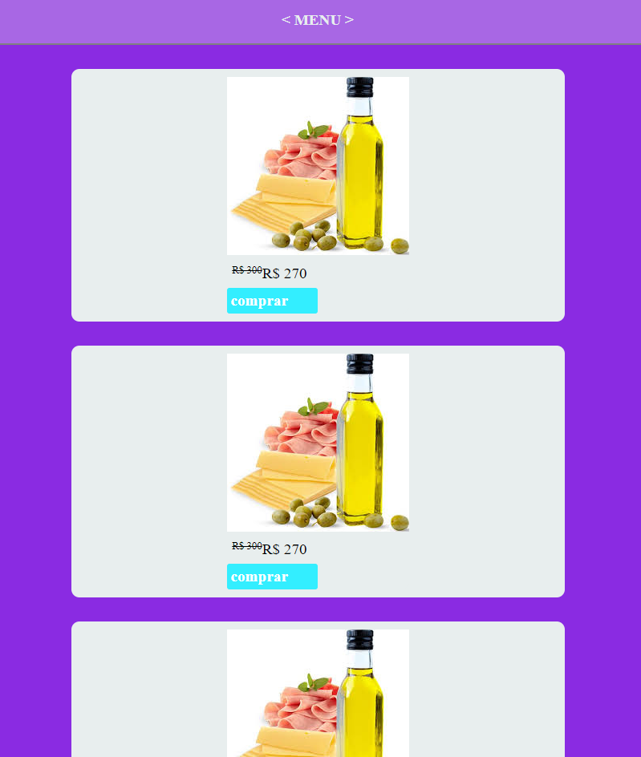
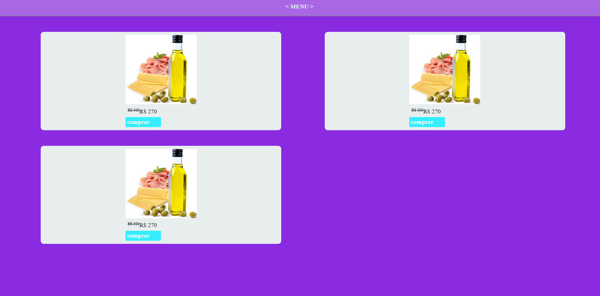

# cards_css

[visualizar](https://vilmar-moreira-souza.github.io/cards_css/)

<h3>sobre a aplicação</h3>

essa aplicação é uma implementaçaõ de cards em html/css <a href="https://vilmar-moreira-souza.github.io/cards_css/" target="blank"> VER .</a>  

<h3>ideias para implementar</h3>
<li>melhorar o design</li>
<li> mais...</li>
